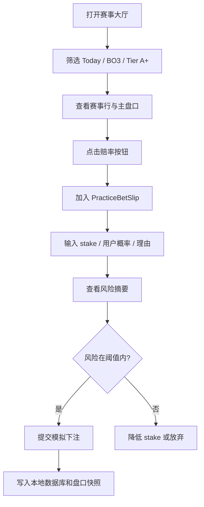
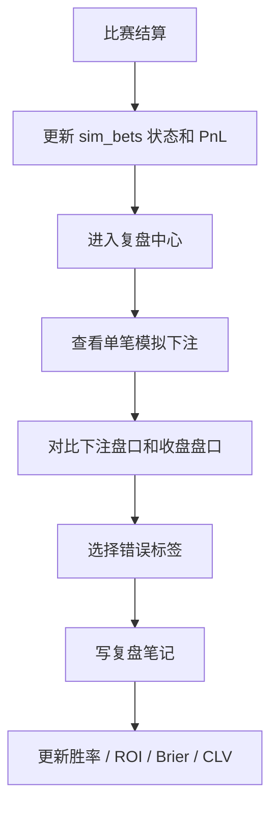

# PolyRader — 产品需求文档 (PRD)

## 1. 产品概述

PolyRader 是一款面向 CS2 电竞赛事的 **博彩模拟盘练习工具 + 本地复盘数据库**。产品使用 sportsbook 风格的信息架构展示 CS2 赛事、盘口和赔率变化，但所有下注行为均为虚拟模拟，不触发真钱交易。

产品品牌统一为 PolyRader，主定位保持 simulation-first。Polymarket、HLTV、链上数据、LLM 和行为金融信号都作为训练辅助数据源，而不是产品主路径。

### 1.1 核心问题

CS2 盘口判断高度依赖赛事理解、地图池、阵容状态、赔率变化和资金管理。用户如果直接用真钱试错，学习成本高，且很难系统复盘自己的判断。

PolyRader 解决的是：

- 如何在不真钱下注的前提下练习盘口判断。
- 如何记录每一笔模拟下注的理由、盘口快照、模型概率和赛后结果。
- 如何用本地数据持续校准自己的胜率、Brier Score、ROI、回撤和错误模式。

### 1.2 目标用户

| 用户 | 需求 | 产品价值 |
| --- | --- | --- |
| CS2 赛事玩家 | 想练习盘口判断，不想真钱试错 | 虚拟本金、模拟投注单、赛后复盘 |
| 数据型 bettor | 想保存下注日志和盘口快照 | 本地 SQLite 数据库、CSV/JSON 导出 |
| AI 策略调参者 | 想比较 AI/行为/市场概率 | 策略实验室、回测、校准指标 |
| Polymarket 观察者 | 想读取市场和个人历史 | 只读账户、历史交易统计、资产曲线 |

### 1.3 产品边界

- 主流程只支持虚拟下注。
- 不出现充值、提现、奖金、返现、VIP 等真钱菠菜激励。
- 不在主 UI 提供实盘下单按钮。
- 保留的 Polymarket 能力默认作为只读数据源和高级实验能力。
- 所有关键用户数据默认保存在本地 SQLite。

## 2. 产品原则

| 原则 | 要求 |
| --- | --- |
| 模拟优先 | 主按钮使用“加入模拟单”“提交模拟下注”“复盘” |
| 本地优先 | 模拟下注、盘口快照、复盘笔记写入本地数据库 |
| CS2 专精 | 围绕 BO1/BO3/BO5、地图池、阵容、赛事 Tier 设计 |
| 高频操作 | 从赛事列表到加入模拟单不超过 2 次点击 |
| 复盘闭环 | 每笔下注都可回看当时价格、概率、理由和结果 |
| 可解释 | AI 和行为金融信号只做辅助，必须展示依据和置信度 |
| 安全透明 | 页面持续标识“模拟练习/虚拟本金” |

## 3. 信息架构

| 一级导航 | 路由建议 | 核心任务 | 现有页面迁移 |
| --- | --- | --- | --- |
| 赛事大厅 | `/` | 浏览 Live/Upcoming CS2 比赛和盘口 | Dashboard + Daily + Esports |
| 模拟盘 | `/match/:slug` | 单场盘口矩阵、情报、市场、AI 和加入模拟单 | Match Detail |
| 投注单 | 全局右栏/移动抽屉 | 管理待提交模拟注单和风险 | 新组件 |
| 我的账本 | `/bankroll` | 虚拟余额、未结算暴露、资产曲线、风险纪律 | Simulation + Allocation |
| 复盘中心 | `/review` | 已结算注单、错误归因、Brier/ROI/CLV | Signals + AI Stats |
| 数据库 | `/database` | 本地表、快照、导出、备份 | Polymarket Account + local DB |
| 策略实验室 | `/strategy` | AI/行为/市场/聪明钱权重与回测 | AI Config + Prompt Variants + Whales |
| 设置 | `/settings` | 数据源、LLM key、只读账户、备份 | Setup + config pages |

## 4. 核心功能

### 4.1 赛事大厅

赛事大厅是第一屏，不再是泛市场仪表盘。

功能要求：

- 支持 Live、Starting Soon、Today、Tomorrow、Tournament、BO1/BO3/BO5、Tier、地图完整度筛选。
- 赛事按 tournament 分组，默认优先展示 Live 和即将开始的比赛。
- 每行展示比赛时间、状态、队伍、HLTV 排名、赛制、交易量、流动性和主胜盘口。
- 快捷盘口至少包含 Match Winner；后续支持 Map Winner、Handicap、Total Maps、Correct Score。
- 点击赔率按钮直接加入 PracticeBetSlip。
- 长队名、赛事名和盘口名称必须在固定行高内优雅换行或截断。

### 4.2 模拟盘比赛详情

比赛详情是单场“盘口工作台”。

功能要求：

- 第一屏展示队伍、赛制、赛事、开赛时间、Live 状态和虚拟练习状态。
- 中心区域展示盘口矩阵，赔率按钮固定尺寸。
- 右侧展示本场相关的投注单和风险摘要。
- 下方 Tabs：
  - 情报：阵容、地图池、近期状态、交锋记录。
  - 市场：价格曲线、盘口深度、成交量、价格异动。
  - AI：多模型概率、行为金融概率、市场概率和分歧。
  - 复盘：赛后展示盘口快照、赛果、用户笔记和错误标签。
- 提交模拟下注时必须保存用户概率、下注理由、价格、stake、模型快照和市场快照。

### 4.3 PracticeBetSlip

投注单是产品的核心交互组件。

功能要求：

- 桌面端常驻右栏，移动端底部抽屉。
- 支持 Single 和 Parlay Practice；Round-robin Practice 作为后续增强。
- 每个 leg 显示赛事、盘口、选择项、赔率、隐含概率、模型概率、用户概率、edge 和 stake。
- 提交前展示总 stake、最大亏损、潜在返还、组合相关性、单日风险和 bankroll 占比。
- 当风险超过设置阈值时禁用提交或要求用户确认风险。
- 提交按钮文案固定为“提交模拟下注”。
- 提交后写入 `sim_bets` 和 `sim_bet_legs`，并保存 odds snapshot。

### 4.4 我的账本

账本是虚拟账户中心。

功能要求：

- 展示初始本金、当前权益、可用余额、未结算暴露、今日 PnL、总 ROI、最大回撤。
- 展示资产曲线，可按日/周/月切换。
- 展示 open bets、settled bets、voided bets。
- 展示风险纪律：单笔风险、日内亏损、平均 stake、连续亏损、Kelly 偏离。
- 支持训练目标：例如“连续 20 笔记录下注理由”“单笔风险低于本金 2%”。

### 4.5 复盘中心

复盘中心是学习闭环。

功能要求：

- 指标：胜率、ROI、Brier Score、CLV、平均赔率、平均 edge、最大回撤。
- 维度：赛前/赛中、BO1/BO3/BO5、赛事 Tier、盘口类型、队伍、地图。
- 每笔注单可打开详情，查看：
  - 当时盘口快照
  - 收盘盘口
  - 用户理由
  - AI/行为/市场概率
  - 赛果和 PnL
  - 错误标签
  - 复盘笔记
- 错误标签至少包含：高估强队、忽视地图池、追涨盘口、过度相信 AI、仓位过重、临场信息缺失。

### 4.6 数据库

数据库页让用户明确“本地保存了什么”。

功能要求：

- 显示表和记录数：matches、markets、odds_snapshots、sim_bets、sim_bet_legs、signal_snapshots、bet_reviews。
- 显示最近同步时间和数据源状态。
- 支持导出 SQLite、CSV 和 JSON。
- 支持只读账户数据导入/刷新，但不在此页下单。

### 4.7 策略实验室

策略实验室承接现有 AI、行为金融、市场偏差和聪明钱能力。

功能要求：

- 支持配置 AI/行为金融/市场价格三类概率权重。
- 支持用 `signal_snapshots` 做 Brier Score、ROI 和回撤回测。
- 支持 prompt variants 和 LLM provider 表现对比。
- 支持聪明钱观察，但只作为信号来源，不默认自动跟单。
- 输出“训练建议”和“复盘建议”，不输出真钱下注建议。

## 5. 数据模型

### 5.1 新增表

| 表 | 作用 |
| --- | --- |
| `sim_accounts` | 本地练习账户，保存虚拟本金、余额、风险参数 |
| `sim_bets` | 模拟下注主表，保存 stake、odds、status、pnl、reasoning |
| `sim_bet_legs` | 单注/串关 leg，保存 market、selection、odds、result |
| `odds_snapshots` | 下注时和定时采集的盘口快照 |
| `cs2_match_snapshots` | 阵容、地图池、排名、状态快照 |
| `bet_reviews` | 复盘笔记、错误标签、学习结论 |
| `training_sessions` | 训练周期、目标、完成情况 |
| `strategy_profiles` | 固定注、Kelly、保守/激进资金参数 |

### 5.2 复用表

| 表 | 新定位中的用途 |
| --- | --- |
| `markets` | 盘口基础表 |
| `matches` / `teams` | CS2 赛事数据库 |
| `signal_snapshots` | 下注时概率快照和回测输入 |
| `simulation_config` | 后续迁移为 `sim_accounts` + `strategy_profiles` |
| `llm_analyses` / `llm_stats` | 策略实验室和复盘中心 |
| `whale_trades` / `copy_trades` | 聪明钱观察和纸面信号，不作为主路径 |

## 6. 关键流程

### 6.1 赛前练习流程

### 6.2 赛后复盘流程

## 7. 非功能需求

| 类别 | 要求 |
| --- | --- |
| 本地优先 | 无登录也可完整使用，核心数据在本地 SQLite |
| 性能 | 赛事大厅首屏交互目标 < 1.5s，盘口按钮点击即时加入投注单 |
| 可靠性 | 外部 API 失败时保留本地历史数据和降级状态 |
| 可审计 | 每笔模拟下注保留下注时所有关键快照 |
| 安全 | LLM key 本地加密；不提交真钱订单；不暴露 private key |
| 可访问性 | 盘口按钮可键盘聚焦，颜色不作为唯一信息 |
| 国际化 | 中文和英文文案同步维护 |

## 8. 验收标准

- 首页第一屏清楚表达“CS2 模拟盘练习工具”。
- 赛事大厅任意赛事可在 2 次点击内加入模拟投注单。
- 提交模拟下注全程不调用真钱交易 API。
- 每笔模拟下注能在本地数据库查到完整 odds/model/reasoning 快照。
- 已结算下注展示 PnL、胜率、Brier、CLV 和复盘标签。
- 移动端可完成筛选、加入投注单、提交模拟下注。
- 视觉上使用 sportsbook 三栏结构，但无充值、提现、奖金、VIP 等真钱激励元素。

## 9. 分阶段交付

### Phase 1：定位和 UI 壳

- 改名和导航重构。
- 增加顶部 `VirtualBankrollBar`。
- 增加右侧/底部 `PracticeBetSlip` 壳。
- 将实盘入口移出主路径。

### Phase 2：模拟下注和本地账本

- 新增 sim 表 migration。
- 支持加入模拟单、提交模拟下注、查看 open bets。
- 我的账本展示虚拟余额和资产曲线。

### Phase 3：赛事大厅和盘口矩阵

- Dashboard 重构为 sportsbook lobby。
- 比赛详情重构为盘口工作台。
- 支持赔率格式切换和价格变化提示。

### Phase 4：复盘中心

- 结算、CLV、Brier、错误标签、复盘笔记。
- 按盘口/赛事/赛制/策略过滤。

### Phase 5：策略实验室

- AI/行为/市场概率权重调参。
- Prompt variants、LLM provider、聪明钱信号统一回测。

## 10. 文档关系

- 产品蓝图：`docs/cs2-simbook-product-redesign.md`
- 视觉规范：`.trae/documents/design-spec.md`
- 架构总览：`.trae/documents/overview.md`
- 技术架构：`.trae/documents/technical-architecture.md`
- 路线图：`.trae/documents/DEVELOPMENT.md`
- 文档审查：`docs/product-docs-audit.md`
