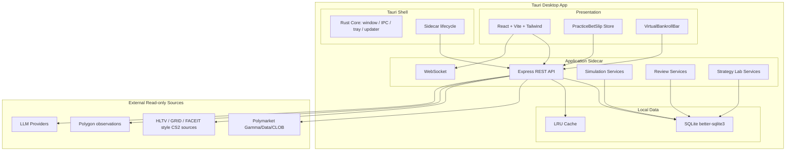

# PolyRader — 技术架构文档

## 1. 架构目标

PolyRader 是本地优先的 Tauri 桌面应用。技术架构需要支持三件事：

1. 高密度 sportsbook 风格前端。
2. 本地 SQLite 持久化练习账户、模拟下注和复盘数据。
3. 外部市场/赛事/AI 数据源的只读采集和策略实验。

主路径不得依赖真钱交易能力。

## 2. 系统架构



## 3. Layer Responsibilities

| Layer | Package | Responsibilities |
| --- | --- | --- |
| Presentation | `packages/web` | UI shell, event lobby, bet slip, bankroll, review, database, strategy lab |
| Application | `packages/server` | REST/WS, simulation orchestration, settlement, review, data source status |
| Domain | `packages/core` | Pure calculations: probability, edge, sizing, settlement, review scoring |
| Infrastructure | `packages/infra` | SQLite repositories, migrations, market/CS2/LLM clients, cache |
| Desktop Shell | `src-tauri` | Native window, config, sidecar lifecycle, filesystem access |

## 4. Target Routes

The current code still contains legacy routes. The migration target is:

| Route | Page | Purpose |
| --- | --- | --- |
| `/` | Event Lobby | CS2 match and odds lobby |
| `/match/:slug` | Simbook Match | Odds matrix, intelligence, market, AI, review |
| `/bankroll` | Bankroll | Virtual balance, exposure, PnL, risk discipline |
| `/review` | Review Center | Settled bets, Brier, CLV, mistake tags |
| `/database` | Database | Local data inventory, export, backup |
| `/strategy` | Strategy Lab | AI/behavior/market/wallet signal tuning |
| `/settings` | Settings | Data sources, LLM keys, read-only account, desktop config |

Compatibility routes may remain during migration:

- `/daily`
- `/esports`
- `/signals`
- `/whales`
- `/ai/config`
- `/ai/stats`
- `/prompt-variants`
- `/simulation`
- `/allocation`
- `/polymarket/account`

## 5. Target API Surface

### 5.1 Simulation Account

```http
GET    /api/sim/account
PUT    /api/sim/account
GET    /api/sim/bankroll
GET    /api/sim/equity-curve
```

Response concepts:

- initialCapital
- currentEquity
- availableBalance
- openExposure
- dailyPnl
- totalPnl
- roi
- maxDrawdown
- riskLimits

### 5.2 Practice Bet Slip / Simulated Bets

```http
POST   /api/sim/bets
GET    /api/sim/bets
GET    /api/sim/bets/:id
PUT    /api/sim/bets/:id/review
POST   /api/sim/bets/:id/settle
DELETE /api/sim/bets/:id
```

Create bet payload:

```ts
interface CreateSimBetRequest {
  accountId: string;
  mode: 'single' | 'parlay';
  stake: number;
  userProbability?: number;
  reasoning: string;
  legs: Array<{
    marketId: string;
    matchId?: string;
    marketType: string;
    selection: string;
    odds: number;
    impliedProbability: number;
    modelProbability?: number;
    behaviorProbability?: number;
    marketProbability?: number;
  }>;
}
```

### 5.3 Odds and Match Snapshots

```http
GET  /api/odds
GET  /api/odds/:marketId/history
POST /api/odds/snapshot
GET  /api/cs2/matches
GET  /api/cs2/matches/:id
```

### 5.4 Review Center

```http
GET /api/review/summary
GET /api/review/bets
GET /api/review/calibration
GET /api/review/mistakes
PUT /api/review/bets/:id
```

Metrics:

- winRate
- roi
- totalPnl
- brierScore
- clv
- maxDrawdown
- averageStake
- averageOdds

### 5.5 Database Inspector

```http
GET  /api/database/summary
GET  /api/database/tables/:name
POST /api/database/export
POST /api/database/backup
```

### 5.6 Strategy Lab

```http
GET  /api/strategy/profiles
PUT  /api/strategy/profiles/:id
POST /api/strategy/backtest
GET  /api/strategy/snapshots
```

## 6. Database Plan

### 6.1 New Tables

```sql
CREATE TABLE sim_accounts (
  id TEXT PRIMARY KEY,
  name TEXT NOT NULL,
  initial_capital REAL NOT NULL,
  current_equity REAL NOT NULL,
  available_balance REAL NOT NULL,
  open_exposure REAL NOT NULL DEFAULT 0,
  risk_limits TEXT NOT NULL DEFAULT '{}',
  created_at TEXT DEFAULT (datetime('now')),
  updated_at TEXT DEFAULT (datetime('now'))
);

CREATE TABLE sim_bets (
  id TEXT PRIMARY KEY,
  account_id TEXT NOT NULL REFERENCES sim_accounts(id),
  mode TEXT NOT NULL DEFAULT 'single',
  stake REAL NOT NULL,
  odds REAL NOT NULL,
  implied_probability REAL NOT NULL,
  user_probability REAL,
  model_probability REAL,
  status TEXT NOT NULL DEFAULT 'open',
  pnl REAL DEFAULT 0,
  reasoning TEXT DEFAULT '',
  placed_at TEXT DEFAULT (datetime('now')),
  settled_at TEXT
);

CREATE TABLE sim_bet_legs (
  id TEXT PRIMARY KEY,
  bet_id TEXT NOT NULL REFERENCES sim_bets(id) ON DELETE CASCADE,
  market_id TEXT NOT NULL,
  match_id TEXT,
  market_type TEXT NOT NULL,
  selection TEXT NOT NULL,
  odds REAL NOT NULL,
  result TEXT DEFAULT 'open',
  pnl REAL DEFAULT 0
);

CREATE TABLE odds_snapshots (
  id INTEGER PRIMARY KEY AUTOINCREMENT,
  market_id TEXT NOT NULL,
  source TEXT NOT NULL,
  market_type TEXT NOT NULL DEFAULT '',
  selection TEXT NOT NULL DEFAULT '',
  odds REAL NOT NULL,
  implied_probability REAL NOT NULL,
  volume REAL DEFAULT 0,
  liquidity REAL DEFAULT 0,
  captured_at TEXT DEFAULT (datetime('now'))
);

CREATE TABLE bet_reviews (
  id TEXT PRIMARY KEY,
  bet_id TEXT NOT NULL REFERENCES sim_bets(id) ON DELETE CASCADE,
  mistake_tags TEXT NOT NULL DEFAULT '[]',
  note TEXT DEFAULT '',
  brier_score REAL,
  clv REAL,
  created_at TEXT DEFAULT (datetime('now')),
  updated_at TEXT DEFAULT (datetime('now'))
);
```

### 6.2 Existing Tables to Reuse

| Existing table | New role |
| --- | --- |
| `markets` | Market/odds base data |
| `matches` | CS2 match cache |
| `teams` | Team facts and map pool |
| `signal_snapshots` | Probability snapshots for backtest/review |
| `llm_analyses` | Strategy Lab input |
| `wallet_*` / `whale_*` | Smart-money observation |

## 7. Domain Calculations

| Function | Description |
| --- | --- |
| `impliedProbability(odds)` | Decimal odds to probability |
| `edge(userProb, impliedProb)` | User edge |
| `expectedValue(stake, odds, probability)` | Expected return |
| `riskFraction(stake, bankroll)` | Stake discipline |
| `settleSimBet(bet, result)` | Status and PnL |
| `brierScore(probability, outcome)` | Calibration |
| `closingLineValue(placedOdds, closingOdds)` | CLV |
| `maxDrawdown(equityCurve)` | Risk metric |

## 8. WebSocket Events

Target events:

```ts
type ServerEvent =
  | { type: 'odds:update'; marketId: string; selection: string; odds: number; ts: string }
  | { type: 'sim:bet-created'; betId: string }
  | { type: 'sim:bet-settled'; betId: string; pnl: number }
  | { type: 'database:sync-status'; source: string; status: string }
  | { type: 'strategy:backtest-complete'; profileId: string };
```

## 9. Security and Safety

- `POST /api/sim/bets` must never call Polymarket order APIs.
- Private keys are not required for the simulation-first product.
- Read-only account credentials must be masked in logs and diagnostics.
- API errors must not leak secrets.
- The main UI must not expose live order controls.

## 10. Migration Plan

1. Add new sim tables.
2. Add domain helpers for simulated bet calculations.
3. Add server simulation endpoints.
4. Add web store for PracticeBetSlip.
5. Build UI shell: `VirtualBankrollBar`, `PracticeBetSlip`, `OddsButton`.
6. Refactor Dashboard into Event Lobby.
7. Refactor Simulation into Bankroll.
8. Refactor Signals/AI Stats into Review Center.

## 11. Verification

Required test coverage during migration:

- Unit tests for bet sizing, EV, settlement, Brier, CLV.
- Server tests for `POST /api/sim/bets` proving no order client is called.
- Browser E2E for adding odds to slip and submitting simulated bet.
- Visual E2E for desktop three-column layout and mobile bet slip drawer.
- Regression test for forbidden real-money words in main UI.
